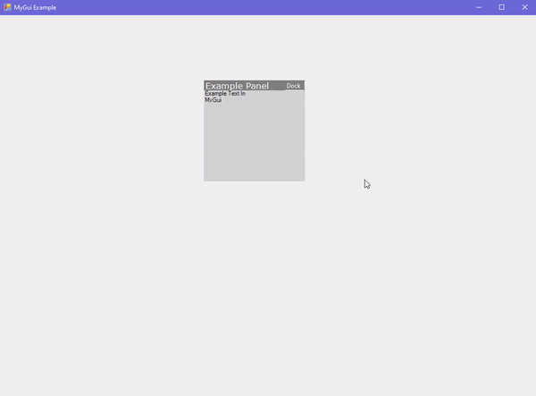
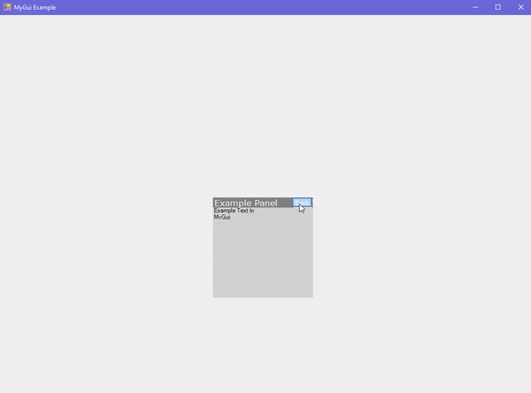

# MyGui

My Gui is Graphical Library for WinForms C#. It has draggable panels/windows.

## Example

If you want to see the example, just run [`Example.cs`](https://github.com/Retr0A/MyGui/blob/main/myGui/Example.cs) file.

### Screenshots

- Draggable Panels/Windows

- Docking to the Window

